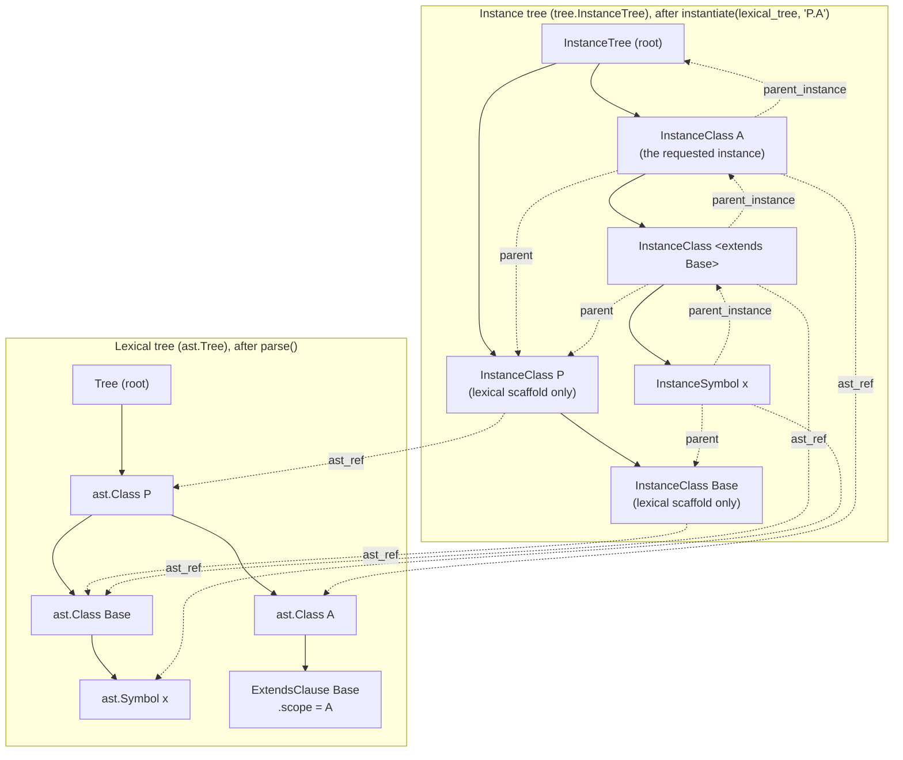

# Pymoca Spec-Based Flattening Architecture

This document explains implementation details that may be difficult to understand or
took a long time to figure out. It assumes some familiarity with the Pymoca architecture
prior to this implementation, so is mainly targeted at collaborators and those familiar
with Modelica compiler inner workings.

The architecture is based only on the Modelica Language Specification (MLS) and prior
versions of Pymoca. It attempts to follow the spec with little performance or memory
optimization to muddy the connection with the spec. It contains what is needed to get it
to pass flattening tests on the ModelicaCompliance Suite and Modelica Standard Library.
There are remaining features to be implemented, but the core instantiation and
flattening algorithms appear to be broadly working for the test suite.

## References

The ground truth for all language syntax and semantics decisions, in priority order:

- [**Modelica Language Specification v3.5**](https://specification.modelica.org/maint/3.5/MLS.html)
- [**Modelica Grammar**](modelica_grammar.txt) is the MLS v3.5 Appendix A concrete
  syntax in plain text
- [**Modelica Compliance Library**](https://github.com/modelica/Modelica-Compliance)
- [**Modelica Standard Library Examples**](https://github.com/modelica/ModelicaStandardLibrary)
- [**MLS Repo**](https://github.com/modelica/ModelicaSpecification) may have additional
  clarification from the v3.5 spec development, version diffs, and later versions
- Pymoca PR #307 has a significant amount of history and discussion

## The Pipeline

This is the new pipeline:

`parser.parse()` -> `ast.Tree` -> `tree.instantiate()` -> `tree.InstanceClass` ->
`tree.flatten_instance()` -> `tree.InstanceClass`

The output of parsing is an `ast.Tree`, the Abstract Syntax Tree (AST) representing the
input Modelica source. It is not mutated by instantiation and flattening so the AST can
be reused for multiple downstream passes.

Instantiation follows MLS section 5.6.1 "Instantiation". During instantiation, a
`tree.InstanceTree` is built up. The instance tree and lexical tree (`ast.Tree` produced
by `parse()`) coexist, with each instance containing an `ast_ref` reference to the
defining lexical `ast.Class`. The `ast.Class` contains a `parent` reference to the
lexical parent of that class. The corresponding instance `tree.InstanceClass` contains a
`parent` reference to the lexical parent, in this case a `tree.InstanceClass` partial
clone of the `ast.Class`, following the MLS procedure, and a `parent_instance` reference
to the instance parent, also a `tree.InstanceClass`. The MLS describes the instance-tree
parent relationship (5.6.1.3), but the explicit `parent_instance` field is a detail of
our implementation. In some cases the `parent` and `parent_instance` refer to the same
thing, but often they do not. The intermediate `tree.InstanceClass` produced by
`tree.instantiate()` still contains the object-oriented class hierarchy and components
they contain with modifications passed down to the applicable level.

The final `tree.InstanceClass` contains the flattened class and functions with
fully-qualified (dotted) names and with the class hierarchy, modifications,
variables/symbols, equations, algorithms, etc. merged into one level.

### Example: Instance tree and abstract syntax tree coexisting

```modelica
package P
  model Base
    Real x;
  end Base;
  model A
    extends Base;
  end A;
end P;
```

Instantiate `model A` in the above Modelica code with:
```python
>>> lexical_tree = parser.parse(code)  # code is the Modelica above
>>> instance = tree.instantiate(lexical_tree, "P.A")
```

Below is a diagram of the trees after instantiation. The solid arrows are tree edges
(parent to child via `.classes`/`.extends`/`.symbols`) and dashed arrows are
`ast_ref`/`parent`/`parent_instance` references. Some arrows are omitted for clarity.



Some things to notice in the diagram:

- `ast_ref` is the only reference that crosses into the lexical tree (dashed lines to
  the left subgraph). `.parent` stays *within the instance tree*: it points to another
  `InstanceClass` (the instance representing the lexical container), never directly to
  an `ast.Class`.
- For the top-level instantiated class `A`, the `.parent_instance` is the `InstanceTree`
  root itself, not an instance of `P`, per MLS 5.6.1.3. So `.parent` and
  `.parent_instance` are different `InstanceClass`es.
- The base class of `A`, `Base`, is instantiated as an unnamed node, shown as
  `<extends Base>` in the diagram. Its `.parent_instance` references the `A` instance,
  while its `.parent` is a minimal instance representing its lexical parent `P` for
  correct name lookup.
- `InstanceSymbol` follows the same `.ast_ref`, `.parent`, and `.parent_instance`
  relationships as `InstanceClass`.

There is a surprising implementation detail not visible in the diagram. Pymoca creates
an `InstanceClass P` at each site that needs a lexical-parent instance rather than
reusing one shared object. There is one for `A` and `<extends Base>` has its own copy
because the extends processing for `Base` looks up its own lexical parent separately.
These separate `P` lexical instances share the same `ast_ref` and tree position but are
distinct objects. See "Caching & Object Identity" below for the identity hazards this
raises. Obviously this is an area ripe for improvement.

Names can be looked up with `tree.find_name()` in either the lexical tree produced by
the parser, in the instance tree, or in a flat class. The instantiation and flattening
processes also do name lookup internally.

See the sections below for more details on the name lookup, instantiation, and flattening
architecture and implementation decisions they reflect.

### Stage ownership: `ast` vs. the instance representation

The parser produces the lexical AST (`ast.Tree`). Instantiation produces the instance
representation of a class (`tree.InstanceClass`). These are kept in separate modules so
a parse-only consumer needs no knowledge of downstream stages: `ast.Tree` = parser
output. The instance types `InstantiationState`, `InstanceElement`, `InstanceClass`,
`InstanceSymbol`, `InstanceTree`, and the `element_instance_*` helpers live in
`tree/instance.py`, the stage that produces them.

`ast.py` has no reference to the instance types.  The AST-is-not-mutated invariant
(enforced in tests) means that a *parsed* `ast.Symbol.type` is always an unresolved
`ComponentRef` and a parsed `ast.Class.extends` is always a list of name-only
`ExtendsClause`. The `ComponentRef` to `InstanceClass` resolution (and the
`ExtendsClause` to `InstanceClass` resolution) happens during instantiation, on the
`InstanceSymbol`/`InstanceClass` clones, never on the parsed node. So the base
annotations are kept name-only (`Symbol.type: ComponentRef`, `Class.extends:
list[ExtendsClause]`). This faithfully represents the Modelica source code for a
parse-only reader and keeps `ast.py` free of any downstream concept.

Instantiation resolves `ast.ComponentRef` to an `InstanceSymbol` or `InstanceClass` as
needed to support the full instantiation and flattening of the top-level class. The
instance subclasses in `tree/instance.py` narrow type annotations accordingly to only
the original `ComponentRef` or the instantiated element that replaces the `ComponentRef`
as instantiation proceeds. They are never `ast.Class` or `ast.Symbol` base classes of
the `Instance*` classes.

These overrides each carry `# pyright: ignore[reportIncompatibleVariableOverride]`.
Mutable members are invariant, so narrowing a container's element type in a subclass is
*formally* unsound - base-typed code could store a plain `ast.Symbol` into
`InstanceClass.symbols`. In practice these containers are populated solely by the
instantiation algorithm, which only ever stores instance elements, so the override is
sound by construction. The suppression is the type system acknowledging the
instantiation-to-AST layer boundary, and is the deliberate price of keeping that
boundary clean. The change is an instantiation concern, so its complexity is paid in
`tree/instance.py`, not pushed up into `ast.py`.

## Package Layout

`src/pymoca/tree/` is split into five submodules:

| Module              | Contents                                                      |
| ------------------- | ------------------------------------------------------------- |
| `instance.py`       | `InstantiationState`, `Instance{Element,Class,Symbol,Tree}`   |
| `_listener.py`      | `TreeListener`, `TreeWalker`                                  |
| `_name_lookup.py`   | `find_name` and helpers (MLS Chapter 5)                       |
| `_instantiation.py` | `instantiate` (MLS 5.6.1)                                     |
| `_flattening.py`    | `flatten_class`, `flatten_instance`, `flatten_to_tree` (MLS 5.6.2) |

`__init__.py` re-exports all public symbols for a backward-compatible `tree.*` API, and
defines the exception hierarchy (`ModelicaError` and subclasses) plus the `RecursionGuard`
and `LookupOptions` dataclasses.

## Name Lookup (MLS Chapter 5)

Entry: `find_name(scope, name)` -> `_find_name()` -> `_find_simple_name()` -> `_find_rest_of_name()`

- **Simple name** (MLS 5.3.1): local -> inherited -> imported -> parent scope (stop at `encapsulated`)
- **Composite name** (MLS 5.3.2): lookup simple name first, then search in found element
- Falls back from instance tree to class tree via `ast_ref` when not found
- Cycle detection via a shared mutable `RecursionGuard` dataclass. Per-call
  configuration via the frozen `LookupOptions` dataclass. The guard is mutable so every
  recursive call sees mutations made by its callees. `LookupOptions` is frozen so
  internal call sites can `replace()` for variants without aliasing the caller. These
  are defined in `__init__.py`.
- **Global name** (MLS 5.3.3): a leading dot parses to an empty-name head `ComponentRef`
  element. The `_find_name()` call detects it and restarts the lookup from the root
  scope with enclosing-scope search disabled. Partial-class rejection is TODO - not
  just the 5.3.3 "class used during lookup may not be partial" rule, but the general
  MLS 4.4.2 rule that a partial class may not be instantiated as a component type.

## Instantiation (MLS 5.6.1)

Entry: `instantiate(class_tree, class_name)` -> `_instantiate_class()`

Steps per spec 5.6.1:
1. Find lexical parent instance (`_get_lexical_parent_instance`)
2. `_create_partial_instance()` - create InstanceClass, merge modifiers
3. `_apply_redeclares()` - validate replaceable/final, lookup in modification scope
4. Partially instantiate local classes, symbols, extends
5. Copy equations/algorithms/annotations
6. `_instantiate_symbol()` - lookup type, recurse
7. `_instantiate_extends_list()` - two-pass: partial instantiate all -> check rules -> full
   instantiate

`InstanceElement` carries an `InstantiationState` (`NONE`/`PARTIAL`/`FULL`) IntEnum so
guard conditions can be expressed as ordered comparisons (e.g. `state >= PARTIAL`). The
older `partially_instantiated`/`fully_instantiated` booleans and the `partially: bool`
parameter are gone.

## Flattening (MLS 5.6.2)

Entry: `flatten_instance(instance)` -> `_flatten_instance()` -> `tree.InstanceClass`
Adapter: `flatten_to_tree(root, class_name)` -> `ast.Tree` (for backend compatibility).
The legacy `tree.flatten()` routes directly to this (in `__init__.py`).

`_flatten_instance()` implements spec 5.6.2 step by step:
- **1.1** Insert symbols with dot-separated flat names and strip `input`/`output` prefixes
  from nested symbols
- **1.2** `_evaluate_conditional_declarations()` is a TODO stub
- **1.3** `_resolve_dimensions()` - resolves parametric array dimensions and propagates
  outer symbol dimensions to inner flat symbols
- **1.4-1.5** `_resolve_modifications()` - resolve value/attribute modifications for
  simple types, records TODO
- **1.6** Recurse into non-simple type symbols, propagate outer symbol's prefixes (e.g.
  `parameter`) and dimensions to the leaf builtin symbol
- **1.7** `_collect_and_resolve_equations()` - resolve `ComponentRef`s to flat instance
  names, discover function calls
- **1.8** Recurse into unnamed extends instances (their symbols/equations are appended
  after the locals already inserted in 1.1-1.7)
- **1.9** `_check_all_references_valid()` is a TODO stub

After `_flatten_instance()` returns, `flatten_instance()` runs in order:
- `_flatten_discovered_functions()` - recursively flattens functions found during step
  1.7 (part E).
- **Deferred ref-name fixup** - `_flatten_value_ref_names()` rewrites `InstanceSymbol`
  values whose `.name` is still the class path (e.g. `Pkg.A.x`) to the correct flat name
  (e.g. `x`). This happens when a value modification references an inherited symbol:
  `_resolve_name` falls back to the class tree and returns an InstanceSymbol with the
  full class path because the extends instance is not yet registered in
  `flat_class.symbols`. The fix runs after the entire extends chain has been walked
  (when the flat namespace is complete), matching by `ast_ref.full_name`.
- `_evaluate_parameter_values()` - only when `evaluate_parameters=True`: folds parameter
  and constant values to literals.
- **1.4 (2nd pass)** `_generate_value_equations()` - converts resolved `.value` on
  non-parameter/non-constant symbols into equations, clears symbol `.value` to sentinel.
  RHS `ComponentRef`s still in source scope are resolved to flat names via
  `_EquationRefResolver`.
- **1.9** `_check_all_references_valid()` - TODO stub
- **3** `_process_transitions()` - TODO stub
- **2** `_generate_connect_equations()` - connect expansion, skipped when
  `expand_connect=False`. Uses `_flatten_connect_ref`, `_is_inner_connector`

`flatten_to_tree()` converts the `InstanceClass` result back to a backward-compatible
`ast.Tree` via `_instance_to_ast_class` / `_instance_to_ast_symbol` /
`_add_connector_symbols`.

## Design Decisions

### Scope Tracking

The `scope` field on `ClassModificationArgument` and `ExtendsClause` records where modification
values should be looked up. Parser sets `scope = current_class`. For short class definitions
(`class A = B(mod)`), scope is the *enclosing* class. During instantiation,
`_update_class_modification_scopes()` converts AST Class -> InstanceClass. During flattening,
modifications are resolved in `arg.scope`.

Two roles that previously coincided are kept separate (MLS 4.5.1, 5.6):

- **Lookup scope** - which class to search. Stays at the syntactic site of the
  modification, `arg.scope` (that is how the user wrote it).
- **Flat-naming root** - which class to name the resolved element relative to. Becomes
  the model being flattened.

When a modification ComponentRef resolves to an inherited element, the resolved element
is **cloned and reparented** under the flat root for path-name purposes but **not
registered** in the flat class's symbol table. Registration still happens through the
element's own definition site during the normal flatten walk. This avoids
double-registration. `_resolve_name` walks the full scope-to-`InstanceClass` chain and
uses `parent_instance` (instance hierarchy), not `parent` (lexical).

For Expression-valued modifications, constant folding runs first. When it gives up
because parameter values have not yet been propagated, a fallback ComponentRef-rewriting
walker applies the same global-path replacement so kept Expressions emerge with globally
rooted names (e.g. `e.H_b` rather than `H_b`).

### Name Lookup Instance -> AST (`ast_ref`) Fallback

`_find_name` (the shared entry point for both simple and composite name lookup) falls
back from the instance tree to the lexical class tree via `scope.ast_ref` when a name is
not found in the instance tree. For an `InstanceClass` this is safe and necessary: it
fires even mid-instantiation for an instance still below `PARTIAL` (whose `.classes` is
empty), so types defined directly inside an un-instantiated package remain visible. The
recursive call targets an `ast.Class`, which is not an `InstanceClass`, so it cannot
re-trigger the fallback.

### Extends Lookup: `search_inherited=False/True`

MLS section 5.6.1.4 states "The classes of extends-clauses are looked
up before and after handling extends-clauses; and it is an error if those lookups
generate different results." Since extends names must be findable *before* inheritance
is processed, inherited elements aren't available yet - this is the basis for
`search_inherited=False` on the first identifier. The `InheritedBaseClass`
`ModelicaCompliance` test (`shouldPass=false`, `section={"5.6.1"}`) validates this.

For composite extends names (e.g. `extends A.D`), `search_inherited=False` only
restricts the first identifier. Once `A` is found, `D` is looked up inside `A`'s
flattened class using normal lookup including A's own inheritance (per 5.3.2 composite
name lookup rules). The MLS does not explicitly state this - it's an inference from
combining the circularity prevention rule (5.6.1.4) with composite name lookup (5.3.2).

### Extends Processing

Two-pass in `_instantiate_extends_list()`:
1. Partial: find extends class, merge mods, create unnamed InstanceClass
2. Check rules: no name collisions, no mixing builtin/non-builtin extends
3. Full: recursively instantiate each extends

`_check_extends_rules` enforces rules on **every** identifier of the as-written tuple
(`ExtendsClause.component.to_tuple()`), not just the leaf - so a class
that inherits a symbol `B` from one base and then writes `extends B.C` from another base
is caught. The check runs at the boundary between partial and full extends-instantiation
passes. Earlier the inherited-name table is not yet populated, later full instantiation has
already failed in a less informative way.

### Symbol/Equation Ordering and Storage

`_flatten_instance()` emits local symbols first, then recurses into unnamed extends
instances, so inherited symbols are appended after local ones in the flat output.
Equations are the opposite: The extends recursion runs before local equation resolution,
placing inherited equations before local ones so that inherited symbols are registered
when local equations resolve.
This is a result of our pre-existing `ast.Class` structure with separate
(ordered) `dict`s for symbols, extends, equations, etc. This is a deviation from the MLS
5.6.1.4 instantiation process under "The local contents of the element" step that says
"empty extends-clause nodes are created and inserted into the current instance (to be
able to preserve the declaration order of components)." This ordering deviation (local
before inherited) remains a known limitation for functions whose inputs or outputs are
interleaved across local declarations and an extends clause. We have kept this
limitation for now to avoid additional significant changes on top of what is already a
huge change.

The spec later says: "At the end, the current instance is checked whether their children
(including children of extends-clauses) with the same name are identical and only the
first one of them is kept. It is an error if they are not identical." We currently do
not do this check in Pymoca, but spec-compliant code only produces identical duplicates
anyway, and the `dict` semantics naturally handle culling at the symbol level (though
keeping the last duplicate rather than the first that the spec specifies). Inherited
equations identical to local equations are discarded according to the spec (at the end
of section 7.1). The spec also states that this discarding feature is deprecated, but
warnings should be given in any case. We do not do any of this currently.

### Replaceable/Redeclare (MLS 7.3)

- Only `replaceable` elements may be redeclared
- `redeclare` without `replaceable` is an error (stricter than OpenModelica)
- Plug-compatibility checks (MLS Ch.6) deferred
- Builtin-typed redeclares (`redeclare Real x = 4.0`) assign the redeclare class
  directly as the symbol type rather than mutating the resolved builtin's `extends`.
  Builtin types are re-instantiated from `ast_ref` on every reference, so any mutation
  to the resolved type's state would be wiped on the next instantiation. Carrying the
  modifications on the redeclare class itself replays them on every fresh instance.

### Multiple Top-Level Classes Allowed

Having multiple classes at the top level *of the tree* (across files) is itself
spec-mandated, not a deviation: MLS 5.2 places "an unnamed enclosing class that contains
all top-level class definitions" at the root, and MLS 13.3 resolves top-level names not
found in global scope over the ordered MODELICAPATH library roots. Pymoca's root
`InstanceTree` models that unnamed enclosing class, so using it as a lookup scope is
spec-compliant.

**The spec deviation: multiple top-level classes in one `.mo` file.** MLS 13.4.2
requires that "When mapping a package or class-hierarchy to a file (e.g. the file A.mo),
that file shall only define a single class A," and that "A .mo file defining more than
one class cannot be part of the mapping to file-structure and it is an error if it is
loaded from the MODELICAPATH" (13.4.1 likewise requires `package.mo` to hold a single
stored-definition naming the structured entity). Pymoca does not enforce this. The
grammar itself permits it - the `stored-definition` rule is `{ [final] class-definition
";" }`, so a multi-class file is legal *syntax* and 13.4 is a *file-mapping* constraint
violated at load time, not a parse error. Three `parser.py` sites drive the difference:

- `ASTListener.exitStored_definition` stores *every* `stored_definition_class()` into
  `ModelicaFile.classes` with no single-class check.
- `file_to_tree` does `insert_node.classes.update(f.classes)`, copying *all* top-level
  classes from a directly-parsed file into the tree - so `parse_file` / `parse_text`
  retain them all. This is the path that accepts the multi-class file.
- `LazyParseClass._parse_in_place` instead keeps only `file.classes[<file-stem>]`, silently
  dropping any other top-level classes when loading via MODELICAPATH. That keeps the tree
  clean but still does not raise the error 13.4.2 mandates - a separate, quieter deviation
  (silent drop vs. error).

A related backward-compatible detail (distinct from the deviation above, and not about
multiplicity): the root `InstanceTree` is included in the `scope.ast_ref` fallback's scope
check (`isinstance(scope, (InstanceClass, InstanceTree))`), so a missing top-level
name can be resolved by reading the lexical class tree directly. The spec's lookup
substrate is the instance tree - 5.6.1.2 ("The output of the instantiation process is an
instance tree") and 5.6.1.3 ("During instantiation all lookup is performed using the
instance tree"), built from the class tree with parts allowed to be built lazily (5.6.1)
- so the purely instance-tree-driven path would materialize the missing top-level class
on demand (as `instantiate_in_place` does elsewhere) rather than read the `ast.Class`.
For unmodified top-level classes the two are normally equivalent, so the root fallback is
kept as a shortcut. A `TODO` tracks removing `InstanceTree` from the check.

### MODELICAPATH Precedence (MLS 3.5 §13.3)

§13.3 treats MODELICAPATH roots as an **ordered list**: a top-level name is resolved by
the first root that contains it, and the class is loaded entirely from that root - no
merging, no fall-through to later roots. `parser.modelicapath_to_tree` implements this as
a first-wins union at top-level name granularity: for each root's tree, a top-level class
name is added only if no earlier root already contributed a class of that name. Because
each root's tree is built of `LazyParseClass` stubs (parsing is lazy per-file), this
first-wins policy at stub-assembly time is observationally equivalent to a "load the whole
class from the winning root" semantics - nothing below the top level is ever merged across
roots. Same-named libraries in later roots are simply shadowed by the first root's
version.

The CLI builds the MODELICAPATH tree before parsing explicit positional files
(`compiler.py`'s `_run_pipeline` calls `modelicapath_to_tree` then `parse_all`, which
`extend`s each parsed file into that tree). `modelicapath_to_tree` returns a
`ModelicaPathTree` (a `Tree` subclass in `parser.py`) whose `_extend` override makes an
explicit top-level class **shadow a same-named library stub entirely**, rather than
merging with it: when a name collides with an unparsed `LazyParseClass`, the stub is
removed and replaced outright. Collisions with an already-explicit (non-stub) top-level
class still merge recursively, so multiple positional files sharing a `within` prefix
continue to synthesize one package. This matches §13.3: MODELICAPATH is consulted only
on a miss against the unnamed top-level scope built from directly-loaded files.

One user-visible consequence: because pymoca synthesizes a top-level package for a
`within` prefix, `pymoca -p /msl patched/Continuous.mo` now hides all of MSL rather than
patching one class inside it. This is a spec-conforming regression from the old merge
behavior, not a bug - MLS 13.2.2 requires a `within` file to live inside its library's
own directory, so CLI-patching a single library file via a positional argument was never
a spec-defined scenario to begin with.

**Deferred structural direction.** Precedence is currently a merge policy applied once,
at `modelicapath_to_tree` assembly time. A more structural design - roots kept as an
ordered chain of lazy loaders, consulted directly from `_name_lookup` so precedence is
enforced by construction rather than by a one-time merge pass - would make the ordering
unregressable by construction and is the intended future direction, but is not
implemented now.

### Composite-Name Lookup & Lazy Instantiation

The spec defines instantiation (5.6.1, including partial instantiation), composite-name
lookup that "temporarily flattens" a class without its modifiers (5.3.2 bullet 3), and
flattening that instantiates a class in place if it is not already instantiated (5.6.2).
What it presents as cleanly layered procedures are in fact **mutually recursive**:
instantiation looks up the types of its components and base classes (5.6.1 steps 5-6),
and looking a name up inside a class requires that class to be (at least partially)
instantiated and temporarily flattened first. On a tree that is only ever *partially*
built - which is how pymoca instantiates, lazily and driven by lookup itself - that mutual
recursion re-enters the same class on self- and mutually-referential models. The spec
gives the steps but not a termination strategy for this loop. Supplying one is the
implementation's job, and is the source of the trickiest recursion in the codebase, so it
is documented here in full.

**The two roles of lookup.** MLS 5.3.2 resolves a composite name **`A.B.C`** by first
resolving the simple name **`A`**, then:

- if `A` is a *component* (`Symbol`), looking up `B.C` among the component's type's named
  component elements (`_find_composite_name_in_symbols`)
- if `A` is a *class*, "temporarily flattening `A` without the modifiers of this class"
  and looking up `B.C` among the flattened elements - restricted to `encapsulated`
  elements when `A` is not a package (`_flatten_first_and_find_rest`, MLS 5.3.2 bullet 3).

To look *inside* a class, that class's names must be materialized. But materializing them
means instantiating the class, and instantiation runs name lookups of its own - which can
re-enter the very class being instantiated. A naïve "instantiate then look" recurses
forever on any self-referential or mutually-referential class.

**`instantiate_in_place` (the lazy-instantiation switch).**
`LookupOptions.instantiate_in_place` controls whether lookup may instantiate a class on
demand to expose its names.
When `True` (the default), the entry points `_find_simple_name`,
`_find_composite_name_in_symbols`, and `_find_composite_name_in_classes` each call
`_instantiate_class_if_needed_for_lookup` on the current scope before searching it. That
helper does only a **PARTIAL** instantiation and is the choke point for all the recursion
guards below:

- it returns immediately for non-`InstanceClass` scopes (a lexical `ast.Class` already has
  all names available) and for classes already at `>= PARTIAL`
- crucially, it **refuses to instantiate a class already in `guard.current_instances`** -
  i.e. one whose instantiation is in progress higher up the call stack. In that case
  lookup proceeds against whatever names have been populated so far, and `_find_name`
  falls back to the lexical `ast_ref` tree (see below) for anything not yet materialized.

Instantiation, in turn, runs its lookups with `instantiate_in_place=False`
(`_instantiation.py` sets `LookupOptions(instantiate_in_place=False)`), so lookups
performed *during* instantiation do not themselves trigger further instantiation - they
read the lexical tree directly. This split is what breaks the lookup -> instantiate ->
lookup cycle: only top-level (flattening-driven) lookups instantiate, nested ones do
not.

**`_flatten_first_and_find_rest` (when `A` is a class).** When `A` is a class and
`instantiate_in_place=False`, `_find_rest_of_name` performs the spec's "temporarily
flatten" step explicitly: PARTIAL-instantiate `first` (unless it is already a
`>=PARTIAL` `InstanceClass`), build a flat instance with
`_create_partial_flat_instance`, run `_flatten_instance` on it, and look the remaining
name up in `flat_class.symbols`. Flattening is what makes inherited and deeply nested
members reachable as flat dot-separated keys, which a plain recursive `_find_name` would
miss without duplicating much of the flattening logic.

*"Temporary" is narrower than it sounds.* Three lifetimes are in play, and only one is
actually discarded:

- **`flat_class` - is throwaway.** It is a fresh `InstanceClass` whose `parent` /
  `parent_instance` point *outward* at `first_instance`'s enclosing scope, and the only
  things that point *into* it (the reparented class/extends copies from
  `_create_partial_flat_instance`) are never returned. So once the function returns,
  nothing references `flat_class` and it is collected. Its sole purpose is to hold the
  flat symbol namespace for the duration of the lookup.
- **`first_instance` - persistent, by design.** When `first` is not yet instantiated,
  `_flatten_first_and_find_rest` calls `_instantiate_class(..., target_state=PARTIAL)`
  with the default `update_parent_instance=True`, so `_create_partial_instance` registers
  the new instance into `parent_instance.classes`. The partial instantiation of `A` is
  therefore **linked into the live instance tree** and reused by later lookups - this is
  the lazy-instantiation behavior, not a leak. (When `first` is already `>=PARTIAL`,
  `first_instance is first`, already part of the tree.)
- **The returned symbol - a live copy anchored to `first_instance`.** The symbols placed
  into `flat_class.symbols` are a shallow `copy.copy()` of `first_instance`'s symbols
  (step 1.1 of `_flatten_instance`). Their `.parent` / `.parent_instance` / `.type` were
  never reassigned to `flat_class`, so they still point into `first_instance` (or its
  nested sub-instances, themselves registered during the flatten).
  `_flatten_first_and_find_rest` returns one more `copy.copy()` of that symbol with its
  `.name` reset to the simple last segment. So what escapes is a symbol hung off the
  *persistent* `first_instance`, not off the discarded `flat_class`. The throwaway is
  only the namespace scaffolding, never the resolved element or the instantiation it
  came from. (The `else` branch - `rest_of_name` not a direct key - returns
  `_find_name(first_instance, ...)`, which likewise resolves against the persistent
  instance.)

Several hard-won guards live here, each fixing a concrete infinite loop or corruption we
hit:

1. **Package currently being instantiated** (`_find_rest_of_name`, the
   `_currently_instantiating` check). If `first` is a package that is in
   `guard.current_instances` *or* is the `ast_ref` of some in-progress instance, calling
   `_flatten_first_and_find_rest` would recurse through extends-class lookup straight back
   into the same scope. In that case we deliberately skip the flatten path and fall back
   to a plain `_find_name(first, rest_of_name, ...)`.

2. **Flatten only the first name, not the rest** (`_flatten_first_and_find_rest`, the
   `else` branch around
   `_find_name(first_instance, rest_of_name, ..., search_parent=False)`).
   Classes with embedded references to themselves would recurse forever if every
   segment were instantiated/flattened in turn. So flatten-and-look is applied **only to
   the first name** of the composite. The remainder is resolved by ordinary lookup with
   `search_parent=False`. *The spec is ambiguous about how to resolve the rest in this
   case* - this is a pymoca choice, made to terminate, and is the single most delicate
   decision in the lookup code.

3. **Skip re-instantiation when already partial.** `_flatten_first_and_find_rest`
   re-instantiates `first` only when it is not already a `>= PARTIAL` `InstanceClass`,
   otherwise it flattens the existing instance, avoiding redundant work and a second entry
   into instantiation.

4. **Shallow-copy aliasing.** Because `flat_class.symbols` holds shallow copies, a symbol
   entry may still alias an object reachable from the live instance tree. The result is
   `copy.copy`'d once more before its `.name` is rewritten, so restoring the non-flat
   (last-segment) name for the caller does not mutate the shared tree.

5. **Flat-name -> simple-name restoration.** Flattening produces dot-separated flat names
   (`a.up.H`). Callers of lookup expect the simple final segment, so both `flat_class.name`
   and the found element's `.name` are split back to their last component before return.

### Caching & Object Identity

The spec is silent on memoization. Flattening a real model performs enough repeated
lookups that three caches are needed, all with the same non-obvious validity argument and
the same identity hazard.

**Validity window.** All caches are scoped to a single `flatten()` call (they hang off the
per-operation `RecursionGuard`, or a shared set on `LookupOptions`). They are sound only
because an `InstanceClass`'s `extends` list is fully populated at **PARTIAL**
instantiation and never grows afterward, so a "(name, scope) -> result" mapping computed
once stays correct for the rest of the call. Both "found" and "not-found" (`None`) results
are cached.

- `RecursionGuard._find_inherited_cache` - memoizes `_find_inherited`, keyed
  `(name, id(scope))`. Prevents `O(N_lookups × N_extends_depth)` re-walks when the same
  scope recurs in many symbol-type lookups.
- `RecursionGuard._symbol_type_cache` - caches fully-instantiated type classes for symbols
  whose modification environment is empty. Hits are **cloned per instance subtree**
  (`_clone_type_instance`): nested symbols, extends instances, and modification-argument
  scopes are re-parented so member references resolve through the hitting symbol's own
  parent chain rather than the cached original's.
- `LookupOptions._searched_extends` - a set shared by reference across one inherited-scope
  traversal, preventing exponential re-visits of the same scope in diamond inheritance. It
  is excluded from the dataclass's `eq`/`hash` so `replace()`-d option variants still share
  the one set.

**The `id()` reuse hazard (subtle).** Two of these caches key on `id(scope)` /
`id(symbol_type)`. CPython reuses the memory address of a freed object, so a key built from
`id()` can collide with a *different, later* object - a false cache hit. Two defenses:

- `_find_inherited` only caches a result when the scope is safe to key by identity: a
  non-`InstanceClass` (immutable `ast.Class`) or an `InstanceClass` at
  `instantiation_state >= PARTIAL`. Transient sub-`PARTIAL` instances - which are exactly
  the ones that get created and discarded during lookup - are never cached.
- `_symbol_type_cache` keys by the **object itself, not `id()`**, so the dict holds a
  strong reference to the key. As long as the cache lives, the key object cannot be freed,
  so its identity cannot be reused.

### AST Mutation Safety

When `flatten_to_tree` converts the flat `InstanceClass` back to `ast.Class`, the symbols
themselves are fresh objects (from `_instance_to_ast_class`), but their value attributes
(`start`, `min`, `max`, `value`, `dimensions`, ...) come from `_to_ast_value`, which returns
the `ComponentRef` / `Expression` / `Array` objects **by reference** from the parsed AST.
`ComponentRefFlattener` then rewrites those refs to flat names **in place**. Mutating a
shared object would silently corrupt the parsed AST and break every *subsequent* flatten
of any model from the same tree. Two precautions in `flatten_to_tree`'s back-conversion:

- Before walking each symbol with `ComponentRefFlattener`, the non-trivial value attrs are
  `deepcopy`'d (Primaries and scalars are immutable and shared as-is), so the walker only
  ever mutates copies.
- `_connector_type` stubs hold an `ast.Class` whose `ComponentRef`s are likewise shared
  with the parsed AST. They are **stripped before the walk and restored after**, hiding
  them from the walker.

**Ordering constraint:** `_add_connector_symbols` (which sets `_connector_type` on
connector stubs) must run **before** the `ComponentRefFlattener` walk in `flatten_to_tree`.
Primarily this is so the intermediate connector symbols (e.g. `plug_p`) that
`expand_connectors` expects are present in `flat_class.symbols` and equation refs like
`plug_p.pin` resolve. It also matters for the mutation hazard above: the walker descends
into `_connector_type`, so the strip/restore must bracket a walk that already sees the
fully-populated connector symbols.

## TODO / WIP / Stubs

- Partial-class rejection: as a component type (MLS 4.4.2) and in global name lookup
  (MLS 5.3.3) - `partial` is currently never enforced at instantiation
- `_evaluate_conditional_declarations` (MLS 5.6.2 step 1.2)
- `_process_transitions` (MLS 5.6.2 step 3)
- `_check_all_references_valid` (MLS 5.6.2 step 1.9)
- Record modifications in `_resolve_modifications`
- `ExpressionEvaluator` - partial implementation, uses an operator-dispatch table (no
  `eval()`)
- Root `InstanceTree` inclusion in `_find_name()`'s `ast_ref` fallback scope check:
  backward-compatible shortcut (`TODO` to remove `InstanceTree`)
- Built-in functions/operators not yet added to `InstanceTree`
- Iteration variables in name lookup (`for i = i:i+3`)
- Type compatibility / constraining-type / prefix preservation for redeclares (`TODO`
  markers in `_instantiation.py`)
- `final` and `each` on modification arguments: parsed but silently discarded, so
  `final` protection is not enforced (MLS 7.2.6)
- Connector compatibility check on `connect`: members are taken from the left
  connector only, so mismatched connectors are silently accepted (MLS 9.3)
- Imports are effectively re-exported: composite-name lookup searches the target
  class's imports, which MLS 13.2.1.1 forbids - defer to a planned imports rewrite
- Circular extends and self-referential component types are unguarded and raise
  `RecursionError` instead of a Modelica-level error
- Error quality on bad input: raw `KeyError` from `connect()` to an undeclared
  component, duplicate top-level classes silently overwrite, array dimensions are not
  validated as non-negative integers, and deeply nested models raise a bare
  `RecursionError`
